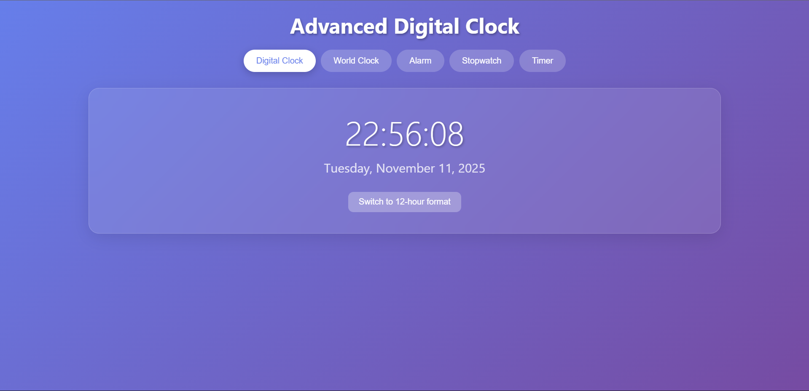

# ⏰ Advanced Digital Clock — Feature-rich React App

A modern, responsive digital clock built with React. Includes a core clock plus world clock, alarms, stopwatch, and timer with a glass-morphism UI.

[Live Demo (replace with your URL)](https://your-username-digital-clock.vercel.app)

Badges
- React 18.2.0
- Deploy-ready (Vercel)
- Responsive design
- MIT License

Highlights
- Real-time digital clock with smooth second animation
- 12/24-hour toggle and full date display
- World clock for multiple timezones
- Multiple persistent alarms with audio notifications
- High-precision stopwatch with laps
- Countdown timer with pause/resume and quick presets
- Glass-morphism UI and responsive layout

Screenshot
Add a screenshot or animated GIF here to showcase the UI:


Quick Start

Prerequisites
- Node.js 14+ (recommend LTS)
- npm or yarn

Clone and install
```bash
git clone git clone https://github.com/BDutta999/Advance-Digital-Clock.git
cd digital-clock
npm install